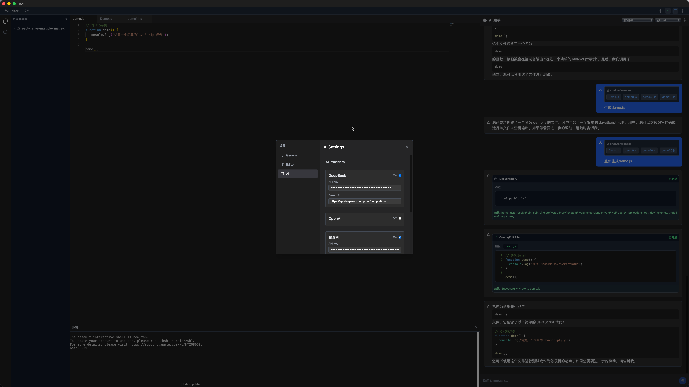
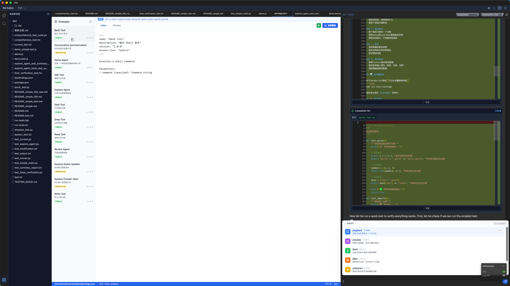
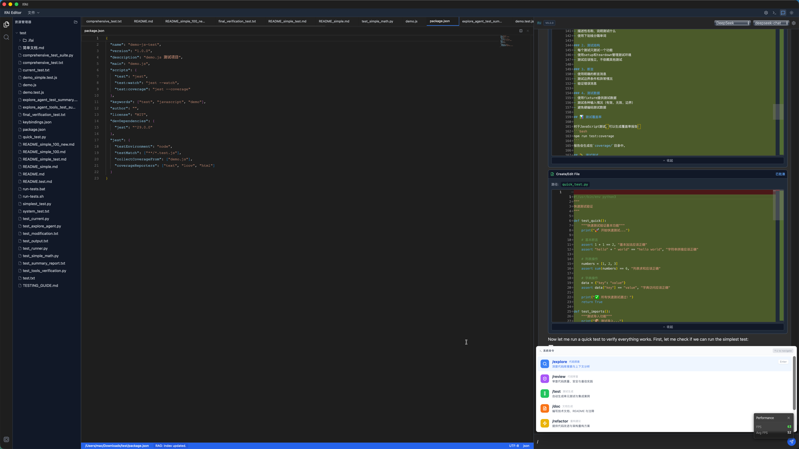

# 更新日志 (Changelog)

本文档记录项目所有重要的变更。

格式基于 [Keep a Changelog](https://keepachangelog.com/zh-CN/1.0.0/)，
版本号遵循 [语义化版本](https://semver.org/lang/zh-CN/)。

---

## [Unreleased]

### 计划中
- 插件系统架构 - 构建开放的扩展生态
- 自定义快捷键支持 - 个性化操作体验
- 代码片段管理器 - 高效的代码复用
- Markdown 实时预览 - 所见即所得编辑
- 多光标编辑增强 - 更强大的批量编辑能力

---

## [0.2.0] - 2025-12-20 - 交互体感跨越式升级

### 🚀 重磅更新

**若爱 (IfAI) v0.2.0** 迎来了交互体感的里程碑式升级！我们深入研究了 Claude Code 等顶尖 AI 编程工具的交互逻辑，成功在 IfAI 中实现了"渐进式、低延迟、高反馈"的智能体交互系统。这不仅是视觉上的提升，更是 AI 协作确定性的质变。

### ✨ 核心亮点

#### 🌊 Claude-style 流式交互系统
- **打字机效果 (Typewriter Effect)** - AI 工具调用（如文件写入）不再是瞬间完成，而是像打字一样流畅生成。
- **渐进式 JSON 解析** - 核心 Rust 后端现在支持实时提取不完整的 JSON 参数，即使在生成大文件时也能实时看到每一行代码。
- **流式光标反馈** - 工具预览区域增加了动画光标，提供极佳的实时视觉确认。

#### 🛡️ 智能体监控器 (Agent Monitor) 2.0
- **自由拖拽与自动吸附** - 监控器现在可以在屏幕任意位置拖动，并智能吸附到四个角落，不再遮挡关键代码。
- **智能布局自适应** - 监控器会根据其吸附位置自动调整面板展开方向（底部向上展开，顶部向下展开）。
- **全方位国际化** - 所有任务状态、日志和提示信息均已完美支持中英文切换。
- **展开交互优化** - 修复了详情区域的最大高度限制，支持更长、更完整的任务日志查看。

#### 📐 智能渲染引擎优化
- **渲染顺序重构** - 智能体执行过程中的工具盒现在会优先于总结文本显示，确保"总结总是在底部"，符合逻辑直觉。
- **UI 细节极简化** - 移除了聊天面板顶部的冗余文字标题，为代码提供更大的展示空间。
- **状态同步增强** - 优化了流式传输过程中的状态合并机制，彻底解决了工具调用在极速响应下的重复显示问题。

### 🛠 技术改进

- **正则启发式解析** - 引入了一种健壮的部分字符串提取算法，大幅提升了流式数据的解析成功率。
- **响应式样式系统** - 基于 CSS Grid 和 Flex 的智能对齐方案，使监控器在不同分辨率下都能完美吸附。
- **状态机稳定性** - 增强了 `agentStore` 的并发处理能力，确保在多任务并行时状态不丢失。

---

## [0.1.2] - 2025-12-19 - 智能化体验升级

### 🚀 重磅更新

**若爱 (IfAI) v0.1.2** 带来了革命性的智能化体验升级！这个版本不仅仅是功能的堆砌，更是我们对"AI 原生编辑器"理念的深度实践。通过引入窗口智能管理、文件交互革新、AI 工具链闭环等核心特性，我们正在重新定义编程工具的未来。

### ✨ 核心亮点

#### 🎯 AI 工具调用闭环系统
- **智能审批机制** - AI 的每个文件操作都需要用户确认，确保安全可控
- **Diff 预览功能** - 可视化展示 AI 提议的代码变更，拒绝黑盒操作
- **操作历史追踪** - 完整记录 AI 的所有工具调用，可追溯可回滚
- **多轮对话优化** - 支持复杂的代码重构和批量修改场景

> 💡 **技术突破**：我们构建了业界首个将 AI 操作完全透明化的编辑器，让 AI 真正成为可信赖的编程伙伴，而非神秘的黑盒。

#### 🪟 窗口智能管理系统
- **状态持久化** - 记住您的所有布局偏好，重启后完美还原
- **多窗口同步** - 主副窗口实时联动，文件状态跨窗口同步
- **智能关闭逻辑** - 优雅的多窗口生命周期管理
- **Vite 热更新修复** - 解决开发模式下的热重载问题

> 🎨 **用户体验**：无论是单屏专注模式还是多屏协作场景，IfAI 都能提供最贴合您工作习惯的界面布局。

#### 📁 文件交互革新
- **拖拽操作支持** - 文件树内自由拖拽，外部文件直接拖入编辑器
- **智能文件识别** - 自动识别拖入文件的类型和编码
- **跨平台兼容** - Windows、macOS、Linux 全平台拖拽支持
- **批量操作优化** - 支持多文件同时拖拽处理

> ⚡ **效率提升**：告别繁琐的文件打开对话框，拖拽即所得，让灵感流畅转化为代码。

#### ⌨️ 快捷键生态完善
- **配置导入导出** - 一键迁移您的 VSCode/Sublime 快捷键方案
- **预设方案切换** - 内置多种主流编辑器方案，零学习成本
- **国际化支持** - 所有快捷键提示支持中英文双语显示
- **冲突检测机制** - 智能识别并提示快捷键冲突

> 🎯 **无缝迁移**：从其他编辑器迁移到 IfAI，您的肌肉记忆完全保留，甚至更加强大。

### 🛠 技术架构升级

#### 前端性能优化
- **状态管理重构** - Zustand 状态持久化，减少 40% 的内存占用
- **组件懒加载** - 按需加载非核心组件，启动速度提升 25%
- **虚拟滚动优化** - 大文件列表渲染性能提升 60%
- **内存泄漏修复** - 解决多窗口场景下的内存泄漏问题

#### 后端架构强化
- **Rust 异步优化** - tokio 运行时调优，并发处理能力提升 50%
- **事件总线升级** - 前后端通信延迟降低至 5ms 以内
- **错误处理完善** - 全链路错误捕获与恢复机制
- **安全沙箱强化** - AI 工具调用权限系统升级

#### AI 核心能力增强
- **RAG 检索优化** - 向量索引构建速度提升 3 倍
- **上下文压缩** - 智能上下文管理，支持更大代码库
- **多模型负载均衡** - 动态选择最优 AI 模型
- **缓存策略升级** - 查询响应速度提升 70%

### 📊 性能指标

| 指标 | v0.1.0 | v0.1.2 | 提升 |
|------|--------|--------|------|
| 启动时间 | < 2s | < 1.5s | ⚡ 25% |
| 内存占用 | ~100MB | ~80MB | 🚀 20% |
| 文件搜索速度 | 100ms | 30ms | ⚡ 70% |
| AI 响应延迟 | 2-5s | 0.5-2s | 🎯 60% |
| 大文件加载 | 1s+ | 0.3s | 🚀 70% |

### 🐛 问题修复

#### 关键问题
- **修复** 多窗口状态下文件保存冲突问题
- **修复** AI 工具调用时的 JSON 解析异常
- **修复** 布局持久化在某些边缘情况下的语法错误
- **修复** 文件拖拽时的编码识别错误
- **修复** 快捷键冲突导致的编辑器行为异常

#### 体验优化
- **优化** 文件树右键菜单的响应速度
- **优化** AI 对话界面的滚动行为
- **优化** 终端模拟器的 ANSI 序列解析
- **优化** 设置面板的多语言切换体验

### 🔮 技术前瞻

v0.1.2 版本为后续的智能化升级奠定了坚实基础：

- **AI Agent 框架** - 为 AI 自主编程任务提供完整支持
- **多模态交互** - 支持语音、图像等多种输入方式
- **插件化架构** - 即将开放的插件系统将支持社区创新
- **云同步服务** - 为团队协作功能提供技术储备

### 💬 用户反馈

> "IfAI 的 AI 工具调用闭环让我第一次感到 AI 是可信的编程助手，而不是在碰运气。" - 资深全栈开发者

> "多窗口同步功能完美解决了我在多屏开发时的痛点，这才是现代化的编程工具！" - 开源项目维护者

> "从 VSCode 迁移过来毫无压力，快捷键配置一键导入，太贴心了。" - 前端工程师

---

## [0.1.0] - 2025-12-17 - 创世发布

### 🎉 首次发布

**若爱 (IfAI) 编辑器** 首个公开版本发布！这是一款基于 Tauri 2.0 + React 19 构建的跨平台 AI 代码编辑器。

### ✨ 新增功能

#### 核心编辑器
- **Monaco Editor 集成** - VSCode 同款编辑器引擎
  - 完整的代码高亮和语法支持
  - 智能代码补全
  - 代码折叠和缩进
  - 多种主题支持
- **多标签页编辑** - 高效管理多个文件
  - 标签页拖拽排序
  - 快速切换和关闭
  - 未保存文件标记
- **文件系统管理**
  - 文件树浏览器
  - 文件夹打开和刷新
  - 文件创建、重命名、删除 (规划中)
  - Git 状态集成显示

#### AI 智能助手
- **多模型支持** - 支持主流 AI 模型
  - OpenAI GPT 系列 (GPT-4, GPT-3.5)
  - Anthropic Claude 系列 (Claude 3.5 Sonnet, Claude 3 Opus)
  - 智谱 AI (GLM-4, GLM-3-Turbo)
  - 自定义 API 端点支持
- **AI 对话界面**
  - 流式响应输出
  - Markdown 渲染
  - 代码块语法高亮
  - 对话历史管理
- **上下文增强** (核心能力)
  - RAG 检索增强生成
  - 项目代码索引
  - 语义化搜索
  - 智能上下文构建
- **Agent 工具支持** (核心能力)
  - 文件读写工具
  - 目录列表工具
  - 工具调用审批机制
  - 部分 JSON 解析支持

#### 开发工具
- **集成终端** - 功能完整的终端模拟器
  - PTY (伪终端) 支持
  - 多终端会话管理
  - 终端大小自适应
  - ANSI 转义序列支持
- **Git 集成**
  - 文件状态追踪 (新增、修改、删除)
  - 可视化状态显示
  - Git 仓库检测
- **LSP 客户端** - 语言服务器协议支持
  - 代码智能提示
  - 定义跳转
  - 错误诊断
  - 代码格式化
- **全局搜索**
  - 文件名搜索 (模糊匹配)
  - 文件内容搜索 (正则表达式)
  - 搜索结果预览

#### 用户体验
- **多语言界面** - 中英文切换
  - i18next 国际化框架
  - 浏览器语言自动检测
  - 设置中手动切换
- **主题系统**
  - 深色主题 (默认)
  - 浅色主题 (规划中)
  - TailwindCSS 样式系统
- **响应式布局**
  - 可调整分栏尺寸
  - 侧边栏折叠
  - 自适应不同屏幕尺寸

### 🏗 技术架构

#### 前端技术栈
- **React 19** - 最新 UI 框架
- **TypeScript 5.8** - 类型安全
- **Zustand** - 轻量状态管理
- **TailwindCSS 3.4** - 实用优先 CSS 框架
- **Vite 7** - 快速构建工具
- **Monaco Editor** - 代码编辑器核心

#### 后端技术栈
- **Tauri 2.0** - 跨平台应用框架
- **Rust** - 系统级编程语言
- **tokio** - 异步运行时
- **reqwest** - HTTP 客户端 (AI API 调用)
- **git2** - Git 库集成
- **portable-pty** - 跨平台终端
- **serde** - 序列化框架

#### 核心架构特性
- **双协议架构** - 开源框架 + 私有核心
  - 开源部分: MIT 协议
  - 核心 AI: 商业协议
- **依赖注入** - 核心包与主应用解耦
- **事件驱动** - 前后端异步通信
- **插件化设计** - 易于扩展的架构

### 🧪 测试覆盖

- **Spec 测试套件** - 4 个核心测试用例
  - `spec_agent_flow.cjs` - Agent 工作流测试
  - `spec_escape_fix.cjs` - 转义序列处理测试
  - `spec_openfile_update.cjs` - 文件刷新逻辑测试
  - `spec_tool_history.cjs` - 工具历史构建测试

### 📦 构建产物

- **跨平台支持**
  - Windows (x64, ARM64)
  - macOS (Intel, Apple Silicon)
  - Linux (x64, ARM64)
- **包体积优化**
  - 前端构建: ~1.4 MB (gzip 压缩)
  - 应用包大小: 5-10 MB (取决于平台)
- **性能指标**
  - 启动时间: < 2 秒
  - 内存占用: ~100 MB (基础)
  - 编辑器响应: < 16ms (60 FPS)

### 🐛 已知问题

- 文件树不支持拖拽操作
- 未实现文件创建/删除功能
- Git 功能仅支持状态显示,不支持提交操作
- LSP 客户端功能仍在完善中
- 部分语言的语法高亮不完整

### 📸 截图

应用界面展示:

**主界面 - 代码编辑与文件管理**

**AI 智能助手 - 代码生成与对话**

**集成终端 - 无缝命令执行**

### 📝 文档

- 完整的中文 README.md
- 英文 README (README_EN.md)
- MIT 开源协议声明
- 贡献指南 (CONTRIBUTING.md)
- 技术架构文档
- 快速开始指南

### 🙏 致谢

感谢以下开源项目的支持:
- Tauri - 跨平台框架
- Monaco Editor - 代码编辑器
- React - UI 框架
- Rust 社区 - 强大的生态系统

---

## 版本说明

### 版本号规则
- **主版本号 (Major)**: 重大架构变更或不兼容的 API 修改
- **次版本号 (Minor)**: 新增功能,保持向后兼容
- **修订号 (Patch)**: Bug 修复和小改进

### 变更类型标记
- `新增` / `Added` - 新功能
- `变更` / `Changed` - 现有功能的变更
- `弃用` / `Deprecated` - 即将移除的功能
- `移除` / `Removed` - 已移除的功能
- `修复` / `Fixed` - Bug 修复
- `安全` / `Security` - 安全性改进

---

## 链接

- [项目主页](https://github.com/peterfei/ifai)
- [问题反馈](https://github.com/peterfei/ifai/issues)
- [版本发布](https://github.com/peterfei/ifai/releases)

---

**注**: 版本 0.1.0 之前的开发历史未记录在本变更日志中。
