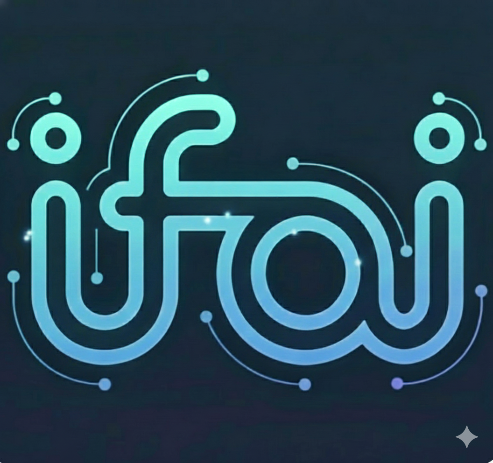

# 若爱 (IfAI) — AI 原生代码编辑器 🚀

  
  
<strong>不只是编辑器，更是你的自主编程伙伴</strong>

  
基于 Tauri 2.0 + React 19 构建的高性能、本地优先的混合智能编辑器

  [简体中文](README.md) | [English](README_EN.md) | [📖 完整文档](https://docs.ifai.today/) | [🎯 下载发布页](https://github.com/peterfei/ifai/releases)

  
  
  
  
  

---

### 🌟 v0.3.8 新特性：任务驱动重构与高保真通讯架构
- **PIVO 3.0 任务规划**：重构指令自动拆解为可视化 **Mission Plan**，支持物理执行状态实时打勾与同步。
- **双屏协同交互**：Inline Assistant 与对话侧边栏达成物理级联动，指令透传、工具调用与反馈结果全链路闭环。
- **高保真流式同步**：引入 80ms 渲染削峰与首片解锁策略，彻底根治流式输出导致的滚轮失效与内容闪现。
- **Sentinel 权威哨兵**：直连内存心跳的物理监测机制，物理回收僵死状态，强制拦截 AI 工具调用中的“文字幻觉”。

---

---

## 💡 为什么选择 IfAI?

在 AI 时代，编辑器不应只是代码的容器，而应是 AI 的躯体。IfAI 采用 **AI 原生 (AI-Native)** 架构，将推理能力深度植入内核。

*   **⚡ 极致性能**：Rust 内核驱动，120 FPS 满帧渲染，即使在万级数据负载下依然丝滑。
*   **🛡️ 隐私与本地优先**：支持 Qwen2.5 等端侧模型，敏感代码不出本地，混合路由自动切换。
*   **🐚 自主 Agent 进化**：不止于对话，Agent 具备 Shell 级操控权，自动配置环境、执行任务、自我纠错。
*   **📑 规范驱动 (OpenSpec)**：深度融合 OpenSpec 协议，确保 AI 遵循工业级设计规范。

---

## 🚀 发展里程碑

我们保持极速迭代，致力于打造最专业的 AI 结对编程环境。

| 版本 | 主题 | 核心突破 |
| :--- | :--- | :--- |
| **v0.3.8** | **任务重构与高保真** | **PIVO 3.0 任务规划引擎、双屏协同交互、渲染削峰算法、Sentinel 权威哨兵** |
| **v0.3.7** | **资产安全与沉浸预览** | **路径感知风险引擎、编辑器原位审批、自动聚焦变更点、Rust 执行层物理沙箱** |
| **v0.3.6** | **UI 重构与结构化** | **模型胶囊面板、PIVO 2.0 异步预览、全链路结构化 PivoProjectTree 渲染** |
| **v0.3.4** | **双模驱动引擎** | **Vibe/Spec 双模交互、插件化技能系统 (Skills)、静默审批自动化、启动耗时消除** |
| **v0.3.0** | **多模态与混合调度** | **Vision LLM 图像理解、本地/远程混合推理调度、智谱 AI 原生支持、Bash 工具集成** |
| **v0.2.8** | **工业级工具链** | **Composer 2.0 (AI 多文件编辑)、RAG 符号感知 (AST 理解)、智能终端自愈** |
| **v0.2.6** | **Agent 进化** | **Shell 能力解锁、结构化任务树、OpenSpec 深度集成、120 FPS 高刷渲染** |

... (rest of the content remains same)
